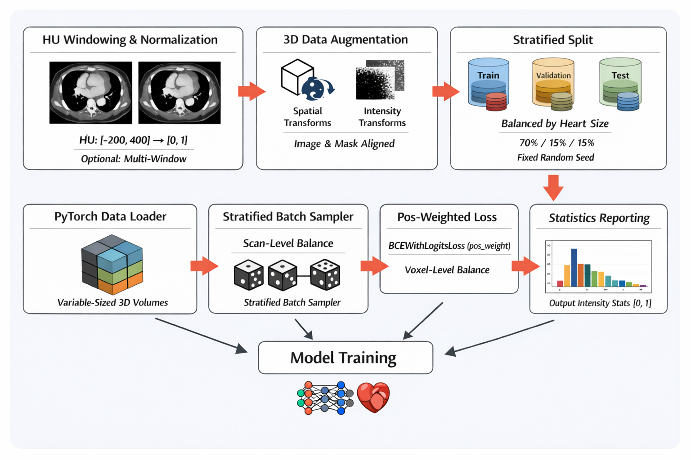
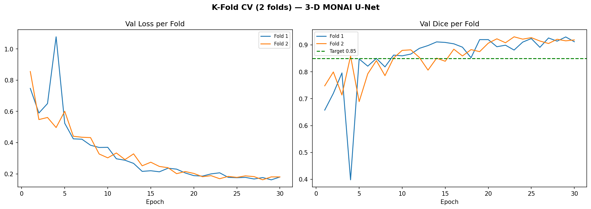
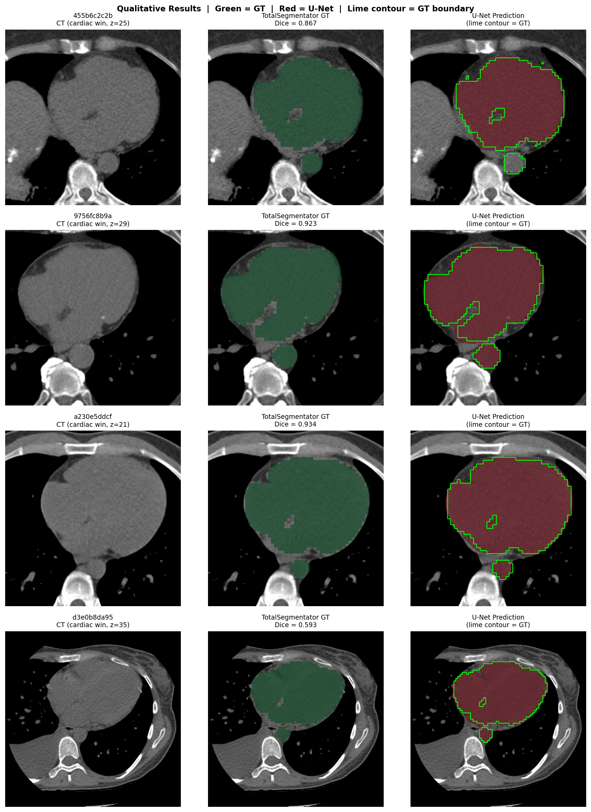

# Cardiac CT Segmentation Pipeline

### Project 1 — Heart Segmentation Model on Cardiac CT (COCA Dataset)

[](https://summerofcode.withgoogle.com/)
[](https://ml4sci.org)
[](https://python.org)
[](https://pytorch.org)
[](https://monai.io)
[](https://github.com/wasserth/TotalSegmentator)


> Google Summer of Code 2026 · **[ML4Sci](https://ml4sci.org)** · **PrediCT Organization**

---
## Overview

This repository contains a full end-to-end pipeline for cardiac CT segmentation:

1. **Automated segmentation label generation** with TotalSegmentator (`run_totalsegmentator.py`)
2. **Preprocessing & data loading** for deep-learning training (`Preprocessing.ipynb`)
3. **U-Net training, K-Fold cross-validation & evaluation** (`Segmentation.ipynb`)

The pipeline targets 50 randomly selected scans from the COCA dataset, generating combined heart + aorta + coronary artery masks that serve as training labels for a lightweight 3-D U-Net.

---

## Repository Structure

```
Heart_segmentation/
├── run_totalsegmentator.py     # Script for automated mask generation using TotalSegmentator
├── Notebooks/                  # Jupyter notebooks for preprocessing and segmentation
│   ├── Preprocessing.ipynb     # HU windowing, data augmentation, dataset splitting, DataLoader setup
│   └── Segmentation.ipynb      # U-Net training, K-Fold cross-validation, evaluation 
├── model_outputs/              # Visualization, validation metrics, saved models
└── preprocessed_data/          # Dataset splits (JSON), statistics, augmentation previews

```

---

## 1. Automated Segmentation — `run_totalsegmentator.py`

This script uses [TotalSegmentator](https://github.com/wasserth/TotalSegmentator) to automatically generate ground-truth–quality segmentation masks for 50 randomly selected CT scans.

### What it does
```
| Step | Task | Details |
|------|------|---------|
| 1 | Scan selection | Randomly selects `NUM_SCANS=50` from `data_resampled/` with seed 42 |
| 2 | Heart & Aorta | Runs `task="total"` with `roi_subset=["heart","aorta"]` (`fast=True`) |
| 3 | Coronary Arteries | Runs `task="coronary_arteries"` (licensed, full-resolution) |
| 4 | Mask combination | Merges three binary masks with `np.maximum.reduce` into one combined mask |
| 5 | Output | Saves `<scan_id>_img.nii.gz` + `<scan_id>_seg.nii.gz` per scan |
| 6 | Results | Writes timing stats and success/failure counts to `processing_results.json` |

```

### Output per scan

```
totalsegmentator_output/
└── <scan_id>/
    ├── <scan_id>_img.nii.gz   # Original resampled CT
    └── <scan_id>_seg.nii.gz   # Combined heart + aorta + coronary mask
```

> **Note:** The `coronary_arteries` task requires a TotalSegmentator license and does not support `fast=True`. It is the primary cause of long processing times. A CUDA-capable GPU is strongly recommended.

---

## 2. Preprocessing — `Preprocessing.ipynb`

A comprehensive preprocessing and data-loading pipeline for cardiac CT segmentation.



### Pipeline Steps

#### HU Windowing
- **Primary window:** center = 100 HU, width = 600 HU → range [−200, 400] HU
- Captures myocardium (~50 HU), blood pools (40–50 HU), vessels, and calcifications (>130 HU)
- **Multi-window mode** (`USE_MULTI_WINDOW=True`): stacks two complementary windows as separate channels
  - Soft tissue: center = 40, width = 400
  - Cardiac: center = 100, width = 600

#### Data Augmentation (3-D, applied jointly to image + mask)
| Transform | Parameters |
|-----------|-----------|
| `RandAffine` | prob=0.5 · ±5°/10° rotations · ±5 voxel translation · ±10%/5% scaling |
| `Rand3DElastic` | prob=0.3 · sigma 5–7 · magnitude 1–2 |
| `RandGaussianNoise` | prob=0.2 · std=0.01 |
| `RandGaussianSmooth` | prob=0.2 · sigma 0.5–1.0 |
| `RandScaleIntensity` / `RandShiftIntensity` | prob=0.3 |

#### Stratified Split
Scans are split **70% train / 15% val / 15% test** stratified by heart segmentation volume tertile, ensuring balanced heart-size distributions across all subsets.

#### Data Loader
- Custom `CardiacCTDataset` with on-the-fly HU windowing (no pre-computed cache)
- `StratifiedBatchSampler` — round-robins across heart-size tertiles so every batch contains a mix of small / medium / large hearts
- Class imbalance (heart ≈ 3–5% of voxels) handled via `BCEWithLogitsLoss` with `pos_weight ≈ 20–30×`

### Key Outputs

| File | Description |
|------|-------------|
| `preprocessed_data/data_split.json` | Train / val / test scan assignments |
| `preprocessed_data/dataset_statistics.json` | Intensity statistics per split |
| `preprocessed_data/hu_windowing_effect.png` | Before / after HU windowing |
| `preprocessed_data/windowing_analysis.png` | Multi-window transformation analysis |
| `preprocessed_data/augmentation_preview.png` | Before / after augmentation |
| `preprocessed_data/sample_visualization.png` | Sample DataLoader output |

---

## 3. Segmentation Model — `Segmentation.ipynb`

A **3-D U-Net** trained in Google Colab with 5-fold cross-validation on 42 training scans, evaluated on a fixed 8-scan held-out test set. and i used 30 epochs with 8 patientce.

Note: is stopped training at fold 3 due to limited GPU at colab

### Architecture — Why U-Net?

- **Encoder–decoder with skip connections** preserves high-resolution spatial detail lost in the bottleneck, critical for accurate heart boundary delineation
- **3-D convolutions** (`spatial_dims=3`) capture full volumetric cardiac context across axial, coronal, and sagittal planes simultaneously
- **Compact parameter count** (~4 M with channels `(32, 64, 128, 256)`) — well-suited to the ~50-scan dataset
- Responds well to strong augmentation and patch-based training

### Training Protocol

| Setting | Value |
|---------|-------|
| Optimizer | AdamW |
| Loss | Dice + BCE |
| Folds | 5-fold K-Fold CV |
| Metric | Dice Similarity Coefficient (DSC) |
| Patch size | 3-D sliding window |
| Hardware | Google Colab GPU |

### Why K-Fold?

With only 50 scans, a single 70/15/15 split leaves 7–8 validation scans, giving a high-variance Dice estimate (±0.05 or more). 5-fold CV uses **all 42 non-test scans across folds** and reports mean ± std, making comparisons far more reliable.


### Model Outputs

| Artefact | Path |
|----------|------|
| Best model weights | `model_outputs/models/heart_unet3d_best.pth` |
| K-Fold learning curves | `model_outputs/seg_kfold_curves.png` |
| Evaluation summary | `model_outputs/seg_evaluation_summary.png` |
| Qualitative overlays | `model_outputs/seg_qualitative.png` |
| Per-scan results CSV | `model_outputs/seg_test_results.csv` |

---

## Results

### Quantitative Performance

| Metric | Value |
|--------|-------|
| K-Fold CV mean val Dice | **0.9297 ± 0.0003** |
| Test mean Dice (baseline) | 0.8434 ± 0.1271 |
| Test mean Dice (+ LCC post-processing) | **0.8549 ± 0.1085** |
| Inference speedup vs TotalSegmentator | **>14× faster** |

> **LCC post-processing** (Largest Connected Component) removes small false-positive fragments, improving test Dice from 0.8434 to 0.8549 and reducing variance.

> The U-Net runs **more than 14× faster** than TotalSegmentator on equivalent hardware (CPU vs CPU, fair comparison), making it suitable for large-scale deployment without requiring a GPU.

### K-Fold Training Curves



*Training and validation Dice scores across completed K-Fold splits.*

### Qualitative Segmentation Results



*Predicted segmentation masks (red overlay) vs. TotalSegmentator reference labels (green, GT boundary in lime) on the held-out test set.*

---

## Setup
Key dependencies: `torch`, `monai`, `SimpleITK`, `totalsegmentator`, `numpy`, `scikit-learn`, `tqdm`, `matplotlib`, `nbformat`


## Acknowledgements

- [TotalSegmentator](https://github.com/wasserth/TotalSegmentator) — Wasserthal et al., 2023
- [MONAI](https://monai.io) — Medical Open Network for AI
- [COCA Dataset](https://stanfordaimi.azurewebsites.net/datasets/e8ca74dc-8dd4-4340-815a-0266b3b9e0e4) — Coronary Calcium and Chest CT studies

---


